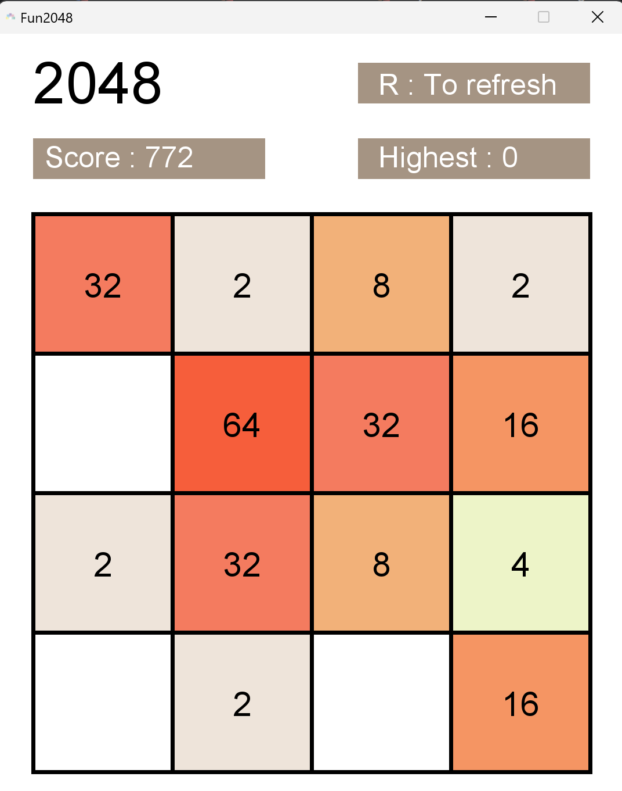
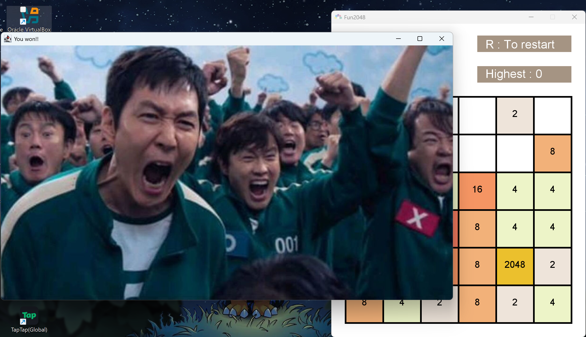
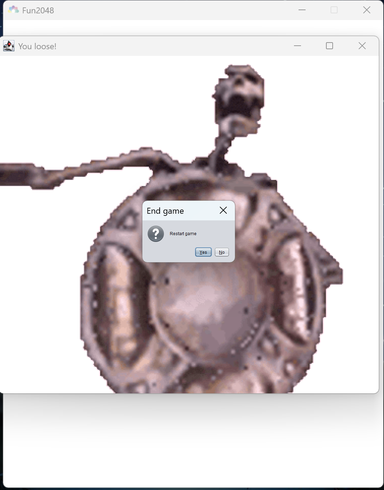

# Fun2048

This project recreates the famous game 2048 in the Scala language!
Add numbers together! Get your best score and work on your powers of 2 😉!

Reach 2048 to win ! But it doesn't end there...

## 🎮 - How to play 
1) Execute *Play.scala* to start the game.
2) Choose the grid size.
3) Use the arrow to play !

###  ⌨️ - Additional Keybinds :
- **Backspace** : To undo your last move !
- **R** : To restart ! 

## Take a look at the main game! 

## This happens when you win

## And this happens when you loose!

## An example of the gameplay !
Link to the video :

# Code structure
## In folder "src"
### Object - Dialog
Manage and creates pop up window to set up the game or to inform the player of some events like : 
- Wining 
- Losing
- etc..

### Object - Game
Manage the game window and the display of the game. It's like a sort of frontend

### Class - Grid
Manage all the state of the game like the : 
- Movement 
- Adding number
- Checking wining - losing conditions
- Etc...

### Class - Number
Manage the state of one cell of the game *inside* the grid like : 
- The number
- The position
- Etc...

### Object - Play
It simply starts the game. It's like a "main" object

### Object - SoundPlayer
Manage all the sounds effects of the game like : 
- Playing a loosing sound
- Playing a victory sound
- Playing sound effect of the movements
- Etc...

